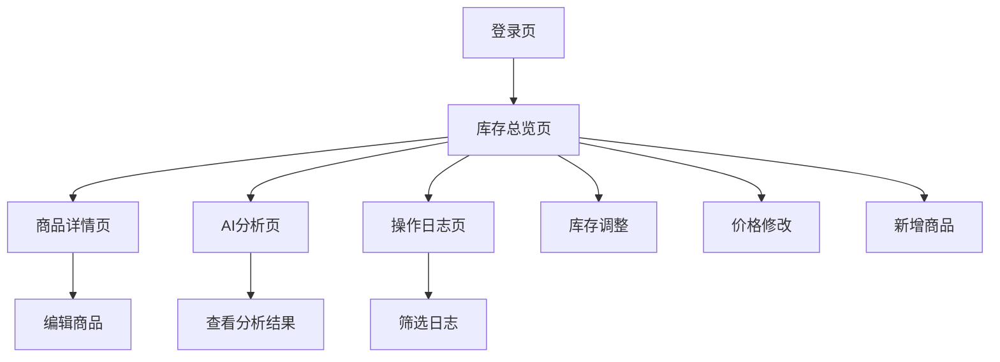

## 1. 产品概述
基于React的库存管理系统前端，提供实时库存管理、AI智能分析和用户友好的操作界面。
- 解决企业库存管理效率低、决策缺乏数据支持的问题
- 面向仓库管理员、采购人员和业务决策者
- 通过实时数据更新和AI分析优化库存周转和定价策略

## 2. 核心功能

### 2.1 用户角色
| 角色 | 注册方式 | 核心权限 |
|------|----------|----------|
| 管理员 | 系统预设账号 | 完整库存管理权限、系统配置 |
| 操作员 | 管理员创建 | 库存增删改查、价格调整 |
| 分析师 | 邮箱注册 | 查看报表、AI分析功能 |

### 2.2 功能模块
库存管理系统包含以下主要页面：
1. **库存总览页**：库存表格展示、排序筛选、库存预警
2. **商品详情页**：商品详细信息、历史记录、编辑功能
3. **AI分析页**：库存分析图表、补货建议、促销推荐
4. **操作日志页**：用户操作记录、数据变更历史

### 2.3 页面详情
| 页面名称 | 模块名称 | 功能描述 |
|----------|----------|----------|
| 库存总览页 | 库存表格 | 展示商品ID、名称、库存量、单位、定价、更新时间，支持排序和分页 |
| 库存总览页 | 库存预警 | 低库存商品红色高亮显示，可设置预警阈值 |
| 库存总览页 | 操作按钮组 | 库存调整(+/-)、价格修改、删除商品，新增商品按钮 |
| 库存总览页 | 实时更新 | WebSocket连接，库存数据实时同步 |
| 商品详情页 | 基本信息 | 显示商品完整信息，支持编辑模式 |
| 商品详情页 | 库存历史 | 展示库存变化趋势图 |
| 商品详情页 | 价格历史 | 展示价格变动记录 |
| AI分析页 | 分析控制 | AI分析按钮、进度指示器 |
| AI分析页 | 分析结果 | 库存周转率图表、定价评估雷达图 |
| AI分析页 | 智能建议 | 补货建议列表、促销商品推荐卡片 |
| 操作日志页 | 日志列表 | 显示用户操作时间、类型、详情 |
| 操作日志页 | 筛选功能 | 按时间、用户、操作类型筛选 |

## 3. 核心流程

### 常规用户流程
1. 用户登录系统 → 进入库存总览页
2. 查看库存表格 → 使用排序功能找到关注商品
3. 点击库存调整 → 输入调整数量 → 实时更新库存
4. 点击AI分析 → 等待分析完成 → 查看分析结果和建议
5. 根据建议进行补货或促销决策

### 管理员流程
1. 登录管理员账号 → 进入系统管理
2. 设置库存预警阈值 → 配置用户权限
3. 查看操作日志 → 监控用户行为
4. 导出库存报表 → 进行业务分析

## 4. 用户界面设计

### 4.1 设计规范
- **主色调**：#1890ff（蓝色）为主色，#52c41a（绿色）为成功色，#ff4d4f（红色）为警示色
- **按钮样式**：圆角矩形，主要操作为实心主色按钮，次要操作为边框按钮
- **字体**：系统默认字体，标题16px加粗，正文14px常规
- **布局**：卡片式布局，顶部导航栏+侧边菜单+主内容区
- **图标**：使用Ant Design官方图标库，保持风格一致

### 4.2 页面设计
| 页面名称 | 模块名称 | UI元素 |
|----------|----------|--------|
| 库存总览页 | 库存表格 | 白色背景表格，斑马纹行，低库存行红色背景，操作按钮组悬浮显示 |
| 库存总览页 | 顶部工具栏 | 搜索框(左)、排序选择器(中)、新增商品按钮(右) |
| 商品详情页 | 信息卡片 | 分模块卡片展示，编辑切换按钮在右上角 |
| AI分析页 | 分析控制区 | 蓝色AI分析按钮，带动画效果，进度条显示分析进度 |
| AI分析页 | 图表展示区 | 库存周转率折线图(左)、定价评估雷达图(右) |
| 操作日志页 | 日志列表 | 时间轴样式，不同类型操作用不同颜色标识 |

### 4.3 响应式设计
- **桌面优先**：默认1440px宽度设计，支持1366px-1920px自适应
- **平板适配**：768px-1024px时转为紧凑布局，侧边菜单收起
- **移动端**：支持基本查看功能，主要操作仍需在桌面端完成

### 4.4 交互设计
- **加载状态**：表格数据加载显示骨架屏，操作按钮禁用状态
- **反馈机制**：操作成功显示绿色提示，失败显示红色错误信息
- **确认对话框**：删除商品、批量操作等重要操作需要二次确认
- **实时更新**：WebSocket连接状态指示器，断线自动重连