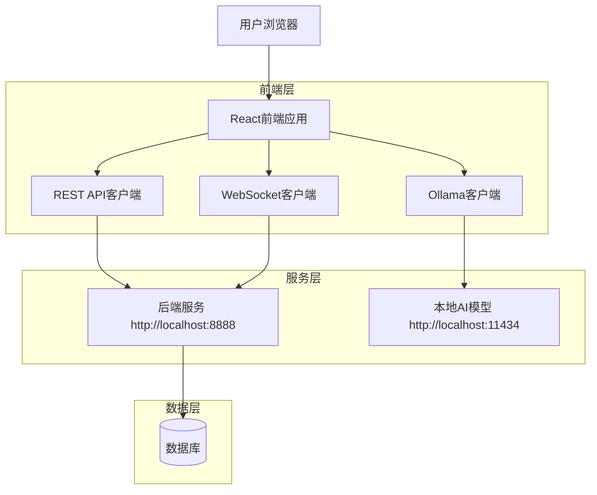
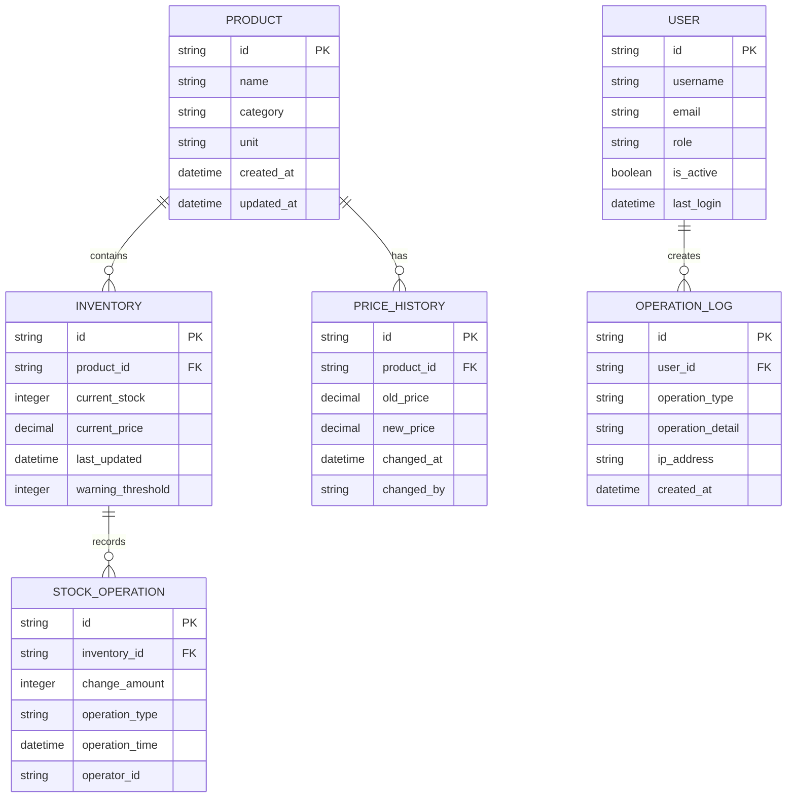

## 1. 架构设计



## 2. 技术描述

* **前端框架**: React\@18 + TypeScript\@5 + Vite

* **UI组件库**: Ant Design\@5 + @ant-design/charts

* **状态管理**: React Context + useReducer

* **HTTP客户端**: Axios    

* **WebSocket**: Socket.io-client

* **AI集成**: Ollama JavaScript SDK

* **测试框架**: Jest\@29 + React Testing Library\@14

* **代码规范**: ESLint\@8 + Prettier\@3

* **初始化工具**: vite-init

## 3. 路由定义

| 路由              | 用途        |
| --------------- | --------- |
| /               | 库存总览页，主页面 |
| /product/:id    | 商品详情页     |
| /ai-analysis    | AI智能分析页面  |
| /operation-logs | 操作日志页面    |
| /settings       | 系统设置页面    |
| /login          | 用户登录页面    |

## 4. API定义

### 4.1 库存管理API

**获取库存列表**

```
GET /api/inventory
```

请求参数：

| 参数名       | 类型     | 必需    | 描述                          |
| --------- | ------ | ----- | --------------------------- |
| page      | number | false | 页码，默认1                      |
| pageSize  | number | false | 每页条数，默认20                   |
| sortBy    | string | false | 排序字段：stock/price/updateTime |
| sortOrder | string | false | 排序方式：asc/desc               |
| search    | string | false | 搜索关键词                       |

响应：

```json
{
  "code": 200,
  "data": {
    "list": [
      {
        "id": "string",
        "name": "string",
        "stock": 100,
        "unit": "件",
        "price": 99.99,
        "lastUpdated": "2024-01-01T00:00:00Z",
        "lowStockWarning": false
      }
    ],
    "total": 100,
    "page": 1,
    "pageSize": 20
  }
}
```

**更新库存数量**

```
PUT /api/inventory/:id/stock
```

请求体：

```json
{
  "change": 10,
  "operation": "increase"
}
```

**更新商品价格**

```
PUT /api/inventory/:id/price
```

请求体：

```json
{
  "price": 109.99
}
```

### 4.2 AI分析API

**获取AI分析结果**

```
POST /api/ai-analysis
```

请求体：

```json
{
  "inventoryData": [...],
  "analysisType": "full"
}
```

响应：

```json
{
  "code": 200,
  "data": {
    "turnoverRate": {
      "chartData": [...],
      "average": 0.85
    },
    "priceAnalysis": {
      "reasonable": true,
      "suggestions": ["建议降价5%"]
    },
    "restockSuggestions": [
      {
        "productId": "string",
        "suggestedQuantity": 100,
        "reason": "库存周转率高"
      }
    ],
    "promotionRecommendations": [
      {
        "productId": "string",
        "discount": 0.9,
        "reason": "库存积压"
      }
    ]
  }
}
```

### 4.3 操作日志API

**获取操作日志**

```
GET /api/logs
```

请求参数：

| 参数名           | 类型     | 必需    | 描述   |
| ------------- | ------ | ----- | ---- |
| startTime     | string | false | 开始时间 |
| endTime       | string | false | 结束时间 |
| operationType | string | false | 操作类型 |
| userId        | string | false | 用户ID |

## 5. 数据模型

### 5.1 实体关系图



### 5.2 前端数据类型定义

```typescript
// 商品库存类型
interface InventoryItem {
  id: string;
  name: string;
  stock: number;
  unit: string;
  price: number;
  lastUpdated: string;
  lowStockWarning: boolean;
  category?: string;
}

// AI分析结果类型
interface AIAnalysisResult {
  turnoverRate: {
    chartData: Array<{ date: string; rate: number }>;
    average: number;
  };
  priceAnalysis: {
    reasonable: boolean;
    suggestions: string[];
  };
  restockSuggestions: Array<{
    productId: string;
    suggestedQuantity: number;
    reason: string;
  }>;
  promotionRecommendations: Array<{
    productId: string;
    discount: number;
    reason: string;
  }>;
}

// 操作日志类型
interface OperationLog {
  id: string;
  userId: string;
  username: string;
  operationType: 'CREATE' | 'UPDATE' | 'DELETE' | 'AI_ANALYSIS';
  operationDetail: string;
  createdAt: string;
  ipAddress?: string;
}

// WebSocket消息类型
interface InventoryUpdateMessage {
  type: 'STOCK_UPDATE' | 'PRICE_UPDATE' | 'NEW_PRODUCT';
  productId: string;
  data: Partial<InventoryItem>;
  timestamp: string;
}
```

## 6. 组件架构

### 6.1 核心组件结构

```
src/
├── components/
│   ├── InventoryTable/          # 库存表格组件
│   │   ├── InventoryTable.tsx
│   │   ├── StockOperation.tsx   # 库存操作按钮组
│   │   └── PriceEditModal.tsx   # 价格编辑弹窗
│   ├── AIAnalysis/
│   │   ├── AIAnalysisPanel.tsx  # AI分析面板
│   │   ├── AnalysisCharts.tsx   # 分析图表组件
│   │   └── ProgressIndicator.tsx # 进度指示器
│   ├── Layout/
│   │   ├── Header.tsx          # 顶部导航
│   │   ├── Sidebar.tsx         # 侧边菜单
│   │   └── Content.tsx         # 内容区域
│   └── Common/
│       ├── LoadingSpinner.tsx  # 加载动画
│       └── ErrorBoundary.tsx   # 错误边界
├── hooks/
│   ├── useInventory.ts         # 库存数据管理
│   ├── useWebSocket.ts         # WebSocket连接
│   └── useAIAnalysis.ts        # AI分析功能
├── services/
│   ├── api.ts                  # API客户端
│   ├── websocket.ts            # WebSocket服务
│   └── ollama.ts               # Ollama AI集成
├── utils/
│   ├── constants.ts            # 常量定义
│   ├── helpers.ts              # 工具函数
│   └── formatters.ts           # 数据格式化
└── types/
    ├── inventory.ts            # 库存相关类型
    ├── api.ts                  # API响应类型
    └── analysis.ts             # 分析结果类型
```

### 6.2 状态管理设计

使用React Context进行全局状态管理：

```typescript
// 库存状态上下文
interface InventoryContextType {
  inventory: InventoryItem[];
  loading: boolean;
  error: string | null;
  filters: FilterOptions;
  updateStock: (id: string, change: number) => Promise<void>;
  updatePrice: (id: string, price: number) => Promise<void>;
  setFilters: (filters: FilterOptions) => void;
}

// WebSocket连接状态
interface WebSocketContextType {
  connected: boolean;
  lastMessage: InventoryUpdateMessage | null;
  reconnect: () => void;
}
```

## 7. 部署配置

### 7.1 开发环境配置

```bash
# 安装依赖
npm install

# 启动开发服务器
npm run dev

# 运行测试
npm run test

# 构建生产版本
npm run build
```

### 7.2 环境变量

```env
# API配置
VITE_API_BASE_URL=http://localhost:8888
VITE_WEBSOCKET_URL=ws://localhost:8888

# AI模型配置
VITE_OLLAMA_BASE_URL=http://localhost:11434
VITE_OLLAMA_MODEL=qwen2.5-14b

# 应用配置
VITE_APP_NAME=库存管理系统
VITE_APP_VERSION=1.0.0
```

